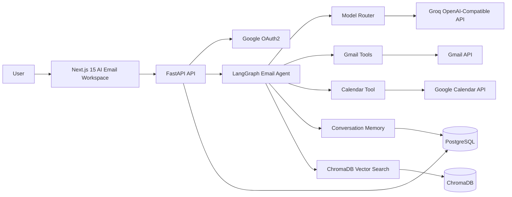

# Architecture

## Boundaries

- Frontend owns the interactive workspace, loading states, and approval UX.
- FastAPI owns auth, sessions, streaming, validation, rate limiting, and orchestration endpoints.
- LangGraph owns typed agent state, workflow routing, retries, and tool execution.
- Provider logic is isolated under `backend/services/llm` so Groq can be replaced with OpenAI, Anthropic, or Gemini adapters.
