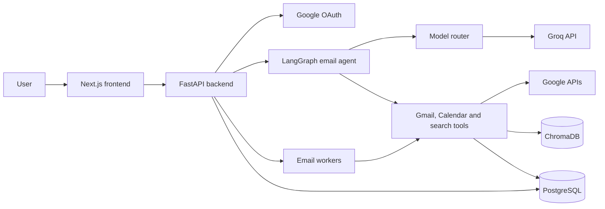
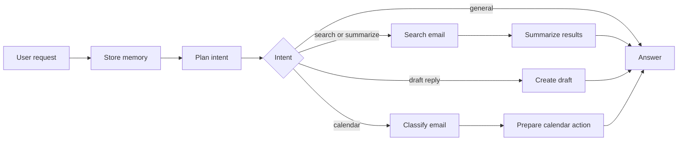
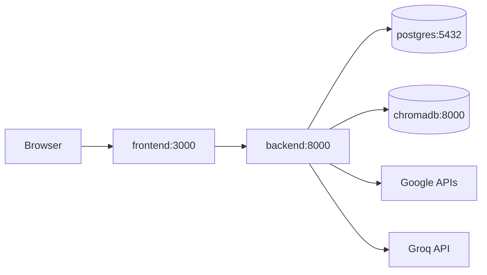

# Architecture

## System View

## Agent Flow

## Main Components

- `frontend/` contains the Next.js workspace, agent console, inbox UI, and recruiter dashboard.
- `backend/api/` exposes auth, agent, email, and dashboard routes through FastAPI.
- `backend/agents/` contains the LangGraph workflow that plans, searches, drafts, summarizes, and responds.
- `backend/tools/` wraps Gmail, Calendar, attachment parsing, OCR, and vector search operations.
- `backend/workers/` syncs Gmail data, builds daily digests, and drafts follow-ups.
- `backend/services/llm/` routes LLM tasks to Groq through an OpenAI-compatible provider layer.
- PostgreSQL stores users, encrypted tokens, synced emails, conversation memory, recruiter leads, and drafts.
- ChromaDB stores email embeddings for semantic search.

## Runtime

