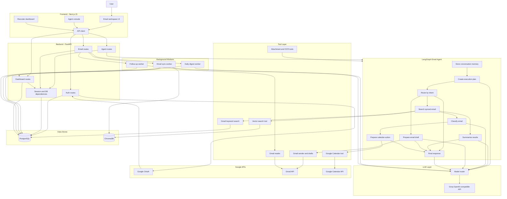
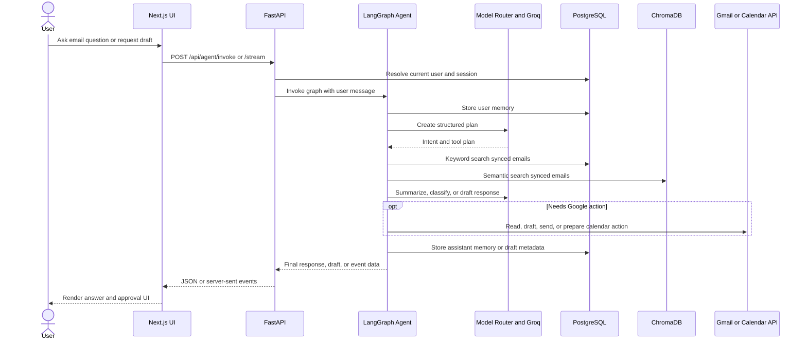
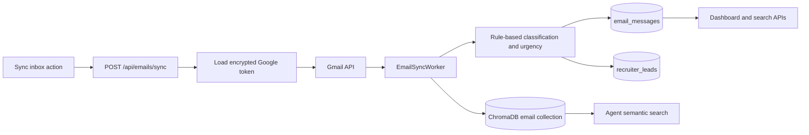
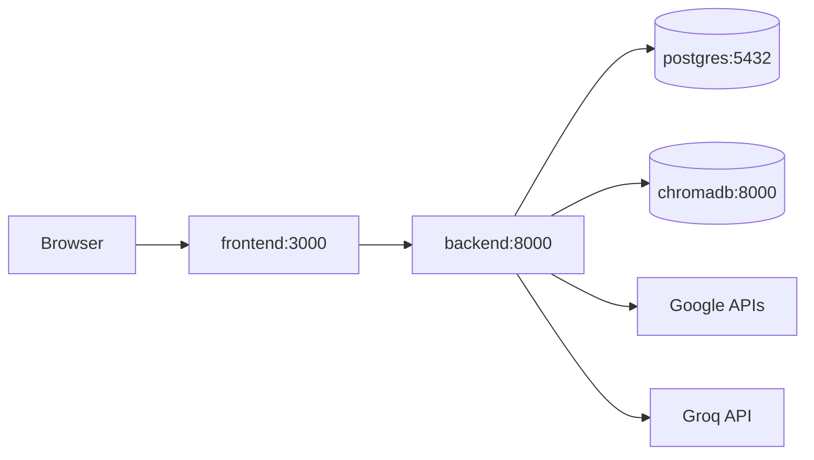

# Architecture

## System Diagram

## Request Flow

## Data Sync Flow

## Runtime Containers

## Boundaries

- Frontend owns the interactive workspace, dashboard, chat console, loading states, and approval UX.
- FastAPI owns auth, HTTP sessions, validation, orchestration routes, and service dependencies.
- LangGraph owns typed agent state, workflow routing, retries, and tool execution.
- Tool modules own Gmail, Calendar, attachment parsing, OCR, and vector-search integration.
- PostgreSQL stores users, encrypted Google tokens, synced emails, conversation memory, recruiter leads, and outbound drafts.
- ChromaDB stores email embeddings for semantic retrieval.
- Provider logic is isolated under `backend/services/llm` so Groq can be replaced with another provider adapter.
