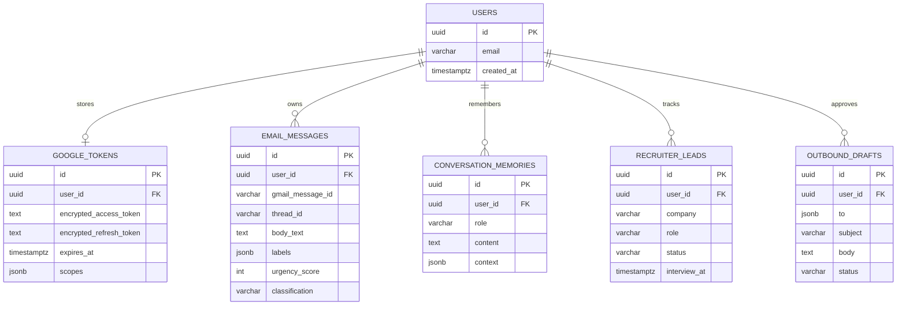

# Database ER Diagram

```mermaid
erDiagram
  USERS ||--o| GOOGLE_TOKENS : stores
  USERS ||--o{ EMAIL_MESSAGES : owns
  USERS ||--o{ CONVERSATION_MEMORIES : remembers
  USERS ||--o{ RECRUITER_LEADS : tracks
  USERS ||--o{ OUTBOUND_DRAFTS : approves

  USERS {
    uuid id PK
    varchar email
    timestamptz created_at
  }

  GOOGLE_TOKENS {
    uuid id PK
    uuid user_id FK
    text encrypted_access_token
    text encrypted_refresh_token
    timestamptz expires_at
    jsonb scopes
  }

  EMAIL_MESSAGES {
    uuid id PK
    uuid user_id FK
    varchar gmail_message_id
    varchar thread_id
    text body_text
    jsonb labels
    int urgency_score
    varchar classification
  }

  CONVERSATION_MEMORIES {
    uuid id PK
    uuid user_id FK
    varchar role
    text content
    jsonb context
  }

  RECRUITER_LEADS {
    uuid id PK
    uuid user_id FK
    varchar company
    varchar role
    varchar status
    timestamptz interview_at
  }

  OUTBOUND_DRAFTS {
    uuid id PK
    uuid user_id FK
    jsonb to
    varchar subject
    text body
    varchar status
  }
```
