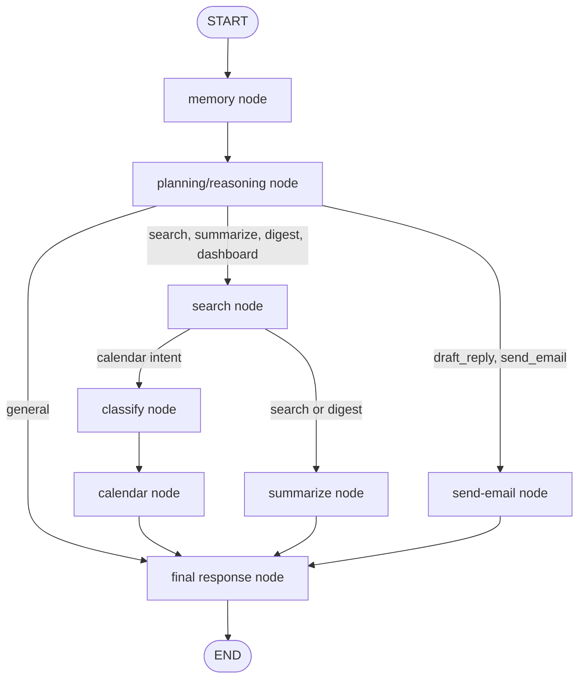

# LangGraph Workflow

The graph uses typed state in `backend/agents/state.py`, structured outputs for planning and classification, and explicit model routing:

- Summaries: `mixtral-8x7b-32768`
- Planning/reasoning: `deepseek-r1-distill-llama-70b`
- Final user responses: `llama-3.3-70b-versatile`
